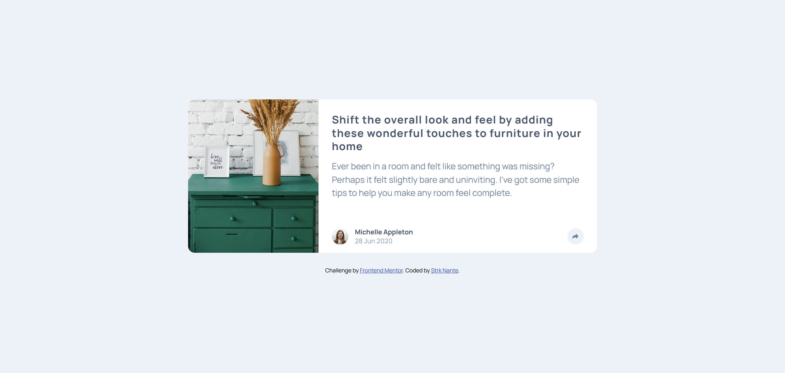
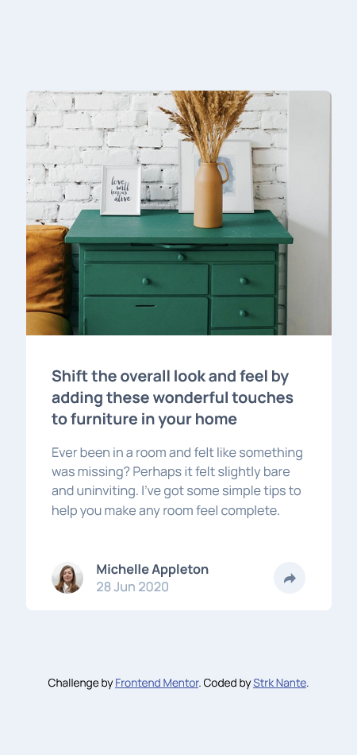

# Frontend Mentor - Article preview component solution

This is a solution to the [Article preview component challenge on Frontend Mentor](https://www.frontendmentor.io/challenges/article-preview-component-dYBN_pYFT). Frontend Mentor challenges help you improve your coding skills by building realistic projects. 

## Table of contents

- [Overview](#overview)
  - [The challenge](#the-challenge)
  - [Screenshot](#screenshot)
  - [Links](#links)
- [My process](#my-process)
  - [Built with](#built-with)
- [Author](#author)

**Note: Delete this note and update the table of contents based on what sections you keep.**

## Overview

### The challenge

Users should be able to:

- View the optimal layout for the component depending on their device's screen size
- See the social media share links when they click the share icon

### Screenshot
- Desktop Preview  
  
---
---
- Mobile Preview

### Links

- Solution URL: [https://github.com/StrkNante/article-component](https://github.com/StrkNante/article-component)
- Live Site URL: [https://StrkNante.github.io/article-component](https://StrkNante.github.io/article-component)

## My process

### Built with

- Semantic HTML5 markup  
- CSS custom properties  
- Flexbox  
- CSS Grid  
- Javascript  
- Mobile-first workflow  

## Author

- Frontend Mentor - [@StrkNante](https://www.frontendmentor.io/profile/StrkNante)
- Twitter - [@StrkNante](https://x.com/StrkNante)

